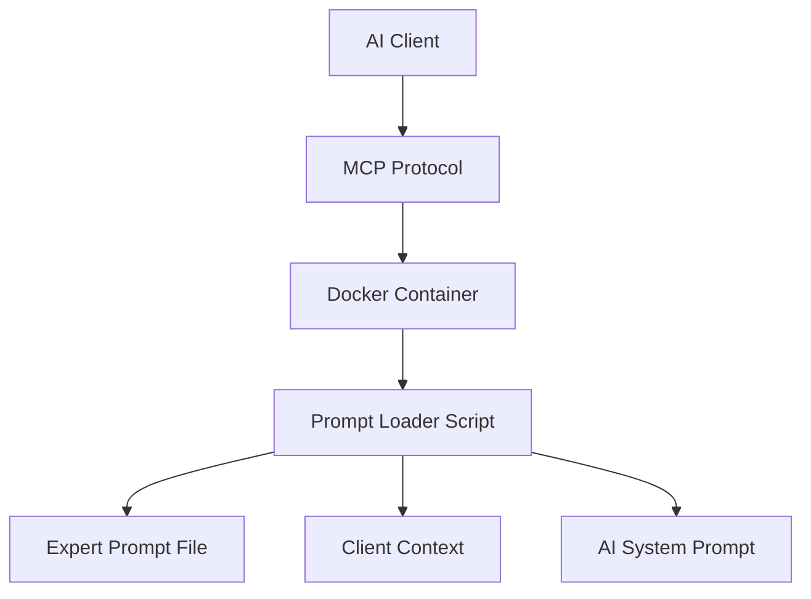

# MCP Client Configuration Examples

This directory contains comprehensive configuration examples for using the `flengure/mcp-prompt-loader` Docker image with various MCP-compatible AI clients and editors.

## 🎯 **Quick Start**

Choose your client and follow the specific configuration guide:

| Client | Configuration File | Description |
|--------|-------------------|-------------|
| **[Claude Desktop](claude-desktop.md)** | `claude_desktop_config.json` | Anthropic's Claude Desktop app |
| **[Gemini Code Assist](gemini-code-assist.md)** | `.gemini-mcp-config.json` | Google's Gemini integration |
| **[Zed Editor](zed-editor.md)** | `~/.config/zed/settings.json` | Modern code editor with AI |
| **[VS Code](vscode.md)** | `.vscode/settings.json` | Visual Studio Code integration |
| **Docker MCP Gateway** | `catalog.yaml` | Docker's official MCP Gateway |

## 🔧 **Common Patterns**

All configurations follow similar patterns with client-specific adaptations:

### **Docker Command Structure**
```bash
docker run --rm -i \
  --pull=always \
  -v "/path/to/prompts:/data:ro" \
  -e "PROMPT_FILE=expert.txt" \
  -e "CLIENT_NAME=client-name" \
  flengure/mcp-prompt-loader:latest
```

### **Environment Variables**
- `PROMPT_FILE` - Which expert prompt to load
- `PROMPT_BASE_DIR` - Directory containing prompts (default: `/data`)
- `CLIENT_NAME` - Identifies the calling client
- `DEBUG_MODE` - Enable verbose logging
- `WORKSPACE_DIR` - Current project directory (when mounted)

### **Volume Mounting**
- **Read-only mount**: `-v "/local/path:/data:ro"`
- **Security**: Always use `:ro` for read-only access
- **Paths**: Use absolute paths for reliability

## 🤖 **Available Experts**

The following expert prompts are included:

| Expert | File | Domain | Use Cases |
|--------|------|--------|-----------|
| **Hummingbot** | `hummingbot.txt` | Algorithmic Trading | Market making, DeFi strategies, bot configuration |
| **n8n** | `n8n.txt` | Workflow Automation | API integrations, data processing, automation |
| **Zed** | `zed.txt` | Code Editor | Editor config, extensions, development workflows |
| **MCP Gateway** | `mcp-gateway.txt` | MCP Development | Tool creation, catalog management, protocol usage |

## 🏗️ **Architecture Overview**



### **Flow**
1. **Client** initiates MCP connection
2. **Docker** starts prompt loader container
3. **Environment** variables specify expert and context
4. **Script** loads prompt file and validates input
5. **Output** expert system prompt to client
6. **AI** operates with specialized domain knowledge

## 🎯 **Configuration Strategies**

### **1. Global Configuration**
- Set up experts in client's global settings
- Available across all projects
- Good for frequently used experts

### **2. Project-Specific Configuration**
- Configure experts per project
- Context-aware expert selection
- Automatic switching based on file types

### **3. Language-Specific Configuration**
- Different experts for different programming languages
- Python → Hummingbot expert
- TypeScript → n8n expert
- JSON/YAML → MCP Gateway expert

### **4. Workspace Integration**
- Mount project directory for context
- Provide file content to experts
- Enable workspace-aware assistance

## 🔒 **Security Best Practices**

All configurations implement security measures:

### **Container Security**
- **Non-root execution** inside container
- **Read-only mounts** prevent file modification
- **Minimal privileges** with `--read-only` flag
- **Resource limits** prevent resource exhaustion

### **Path Validation**
- **Absolute paths** for volume mounts
- **Input validation** for prompt files
- **Restricted access** to only prompt directories

### **Network Security**
- **No network access** unless required
- **Local-only** Docker socket access
- **Isolated containers** with `--rm` cleanup

## 🐛 **Common Troubleshooting**

### **Docker Issues**
```bash
# Check Docker is running
docker info

# Test image manually
docker run --rm -i \
  -e "PROMPT_FILE=hummingbot.txt" \
  flengure/mcp-prompt-loader:latest

# Check container logs
docker logs container_name
```

### **Permission Issues**
```bash
# Linux: Add user to docker group
sudo usermod -aG docker $USER

# macOS: Check Docker Desktop permissions
# Windows: Run as administrator
```

### **Path Issues**
```bash
# Use absolute paths
/Users/username/prompts  # ✅ Good
./prompts                # ❌ May fail
~/prompts               # ❌ May not expand
```

### **Client-Specific Issues**

| Client | Common Issue | Solution |
|--------|-------------|----------|
| **Claude** | Config not loaded | Restart Claude Desktop completely |
| **Gemini** | Authentication | Check Google Cloud credentials |
| **Zed** | Server timeout | Increase timeout in settings |
| **VS Code** | Extension issues | Reinstall MCP extension |

## 🔧 **Advanced Features**

### **Multiple Experts**
Configure multiple experts for different contexts:
```json
{
  "experts": {
    "trading": "hummingbot.txt",
    "automation": "n8n.txt", 
    "development": "zed.txt"
  }
}
```

### **Context Switching**
Automatic expert selection based on:
- File extension
- Project type
- Current directory
- Git repository

### **Custom Prompts**
Create your own expert prompts:
1. Write specialized system prompt
2. Save as `.txt` file in prompts directory
3. Configure client to use new prompt
4. Test and iterate

## 📚 **Examples Repository**

Each client directory contains:
- **Basic configuration** - Minimal setup
- **Advanced configuration** - Full features
- **Project-specific** - Per-project setup
- **Troubleshooting** - Common issues and solutions
- **Performance tuning** - Optimization tips

## 🤝 **Contributing**

To add support for new clients:

1. **Create client directory** - `examples/clients/new-client/`
2. **Write configuration guide** - Follow existing patterns
3. **Test thoroughly** - Verify all features work
4. **Update overview** - Add to this document
5. **Submit PR** - Include example configurations

## 📈 **Performance Tips**

### **Faster Startup**
- Use `--pull=never` if image is cached locally
- Reduce container resource allocation
- Pre-warm Docker cache

### **Memory Optimization**
- Use `--memory=256m` limit
- Enable container resource constraints
- Clean up unused images regularly

### **Network Optimization**
- Use local Docker registry for private networks
- Enable Docker BuildKit for faster builds
- Cache prompt files locally

---

**Ready to get started?** Choose your client above and follow the specific configuration guide!
